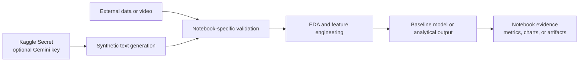

# Kaggle Applied ML Portfolio

[](https://github.com/emrekaany/Kaggle-Projects/actions/workflows/notebook-integrity.yml)
[](LICENSE)

Six applied machine-learning notebooks covering synthetic-data generation, NLP, financial analysis, and computer vision. This repository is a curated learning and experimentation portfolio: it shows the questions explored, the pipeline boundaries, and the evidence that exists without presenting exploratory notebooks as production systems.

## Problem

Notebook collections are often difficult to evaluate because datasets, runtime assumptions, API requirements, and validation status are hidden inside individual files. This repository provides a single recruiter-friendly map of the work and makes the limits of each experiment explicit.

## Architecture



The notebooks are intentionally independent. They do not form one deployable application. See [the architecture notes](docs/architecture.md) for boundaries and the [data provenance guide](DATA_PROVENANCE.md) before running them.

## Selected projects

| Theme | Notebook(s) | Question and pipeline | Evidence status |
|---|---|---|---|
| Synthetic insurance-review NLP | `creating_insurance_customer_review_data_with_generative_ai_GeminiAPI.ipynb`, `data_generating_with_gemini_for_sentiment_model.ipynb`, `insurance-customer-review-analysis-baseline-work.ipynb` | Can schema-constrained synthetic reviews support EDA, TF-IDF baselines, rating/sentiment classification, and topic exploration? | Generation notebooks each contain 4 code cells, 3 executed. The analysis notebook contains 13 code cells, 11 executed. API execution requires the user’s own secret. |
| Financial-news sentiment baseline | `financial-news-sentiment-model.ipynb` | Dataset → stratified split → TF-IDF → logistic regression → saved model artifacts. | The committed run reports 0.3704 test accuracy on 54 examples. This is a transparent baseline, not a production-quality claim. |
| USD/TRY and macro indicators | `try-usd-fx-rates-and-financials-eda.ipynb` | Multi-frequency data alignment → stationarity and correlation analysis → lagged exploratory views. | 10 of 10 code cells are executed with 27 committed output objects. Correlation is not interpreted as causation. |
| Vehicle detection and tracking | `preprocessing-object-speed-by-yolov8-deepsort.ipynb` | Dashcam video → YOLOv8 detections → DeepSORT-compatible tracking preparation. | The snapshot has 5 code cells with no committed execution state or outputs; results must be reproduced in Kaggle before use. |

The full notebook inventory and its machine-readable execution-state audit can be produced with:

```bash
python scripts/validate_notebooks.py
```

## Quickstart

### 1. Clone and validate the portfolio offline

```bash
git clone https://github.com/emrekaany/Kaggle-Projects.git
cd Kaggle-Projects
python scripts/validate_notebooks.py
```

The validator uses only the Python standard library. To run notebooks locally, create a separate environment and install the cross-notebook inventory:

```bash
python -m venv .venv
source .venv/bin/activate
python -m pip install --upgrade pip
python -m pip install -r requirements-notebooks.txt
```

This optional install includes large computer-vision dependencies. `requirements-notebooks.txt` is a dependency inventory, not a byte-for-byte lock of historical Kaggle images. For the closest reproduction, use each notebook’s linked Kaggle version and its recorded Kaggle runtime metadata.

### 2. Supply data at runtime

Datasets and videos are not redistributed here. Open the notebook in Kaggle, attach the data source identified in [DATA_PROVENANCE.md](DATA_PROVENANCE.md), or update the input path for a dataset you are licensed to use.

### 3. Configure Gemini safely, only when needed

The synthetic-data notebooks read `GEMINI_API_KEY_INSURANCE_REVIEW` from Kaggle Secrets or the environment. Never paste a real key into a notebook or commit it.

```bash
export GEMINI_API_KEY_INSURANCE_REVIEW="your-key-in-your-local-shell"
```

The remaining notebooks do not require this key. API calls may incur cost and are never made by the repository validation workflow.

## Measured evidence

The committed notebook snapshots contain 37 code cells in total: 28 have an execution count and 48 output objects are stored. Those counts demonstrate the state of the files, not end-to-end reproducibility or model quality. The integrity workflow checks that every notebook is valid JSON and scans for common committed-token formats without executing data downloads, model training, video processing, or external APIs.

## Limitations

- The repository contains exploratory notebooks, not production services.
- Third-party datasets, competition files, videos, and trained artifacts are not included.
- The Gemini examples require a user-provided key and may produce different output across model versions.
- The financial sentiment result is a small baseline and should not be used for trading or investment decisions.
- The computer-vision notebook has no committed execution evidence.
- Historical Kaggle runtime images are not fully locked by the local dependency inventory.
- Dataset terms, privacy obligations, and model/API terms remain the runner’s responsibility.

## CTA

Interested in data engineering, AI-ready data systems, or turning an experiment into a governed pipeline? Connect with [Emre Kaan Yılmaz on LinkedIn](https://www.linkedin.com/in/emrekaany/) or open a narrowly scoped issue with a reproducibility question.

## License

Repository-authored code and documentation are licensed under the [MIT License](LICENSE). Third-party datasets, competition assets, model weights, generated content, and linked materials are excluded and remain subject to their original terms.
